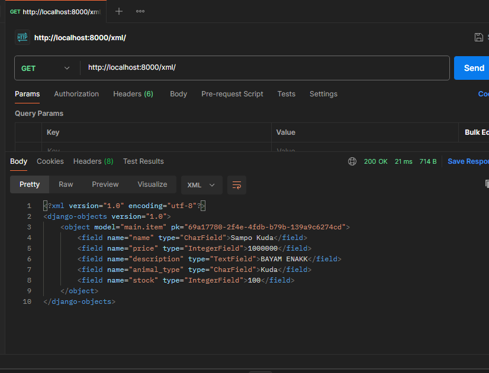
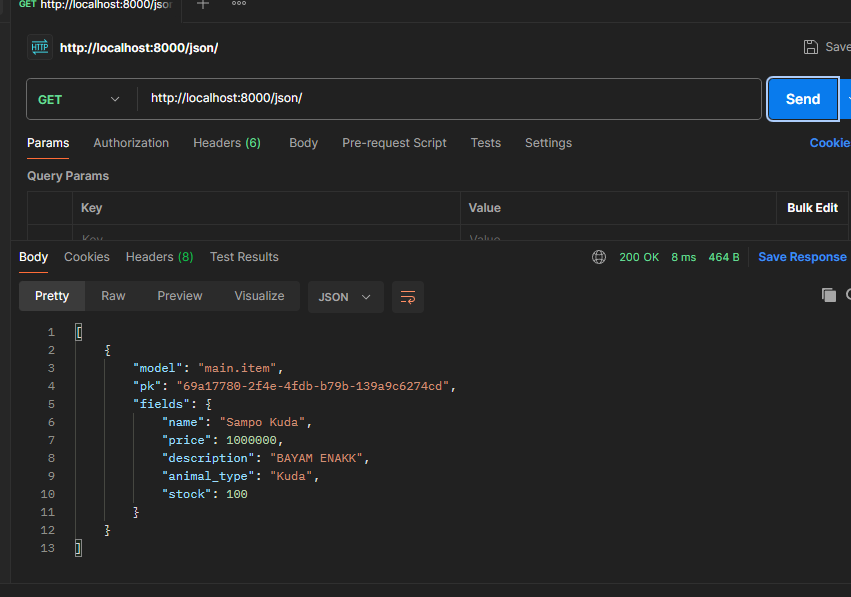
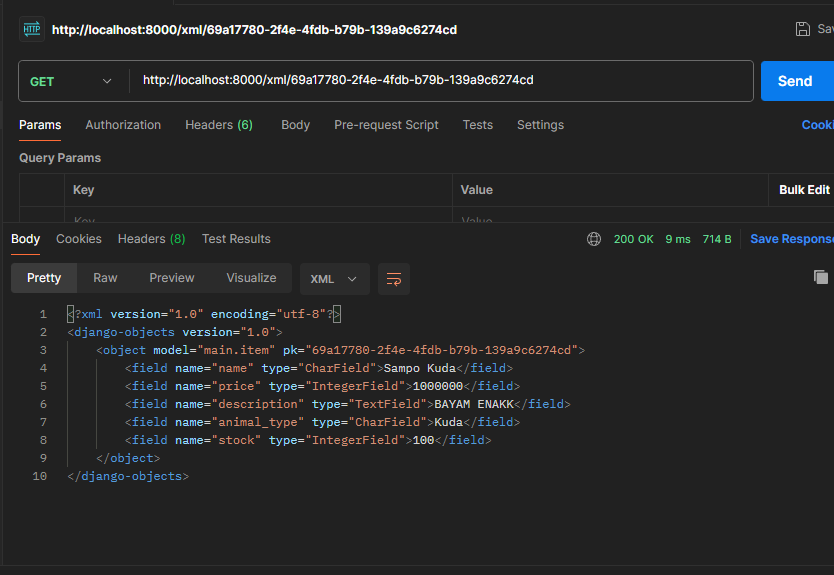
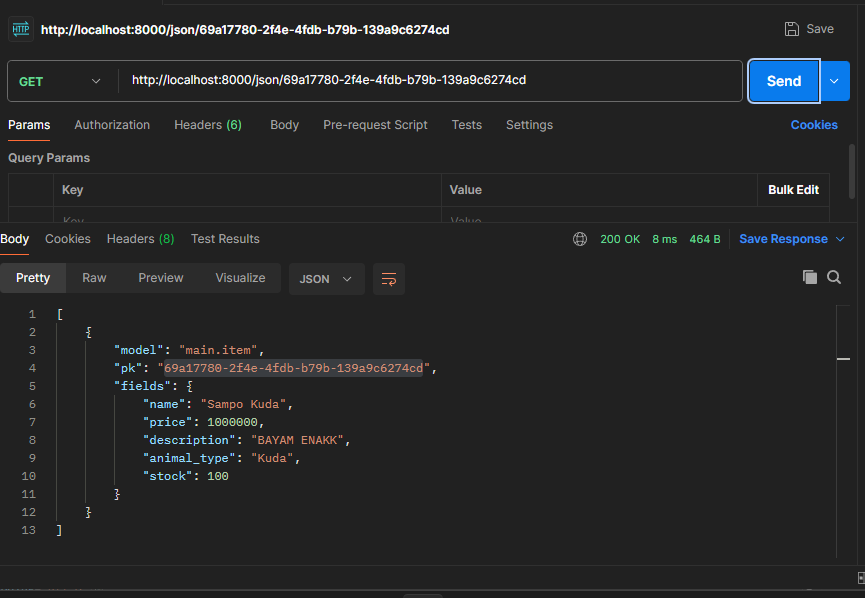

LINK PWS : http://muhammad-rafli33-pandaspetshop.pbp.cs.ui.ac.id/

# TUGAS 2

## 1.) Jelaskan bagaimana cara kamu mengimplementasikan checklist di atas secara step-by-step (bukan hanya sekadar mengikuti tutorial).
##### Membuat sebuah proyek Django baru
Membuat folder lalu membuat venv python. Setelah itu menginstal beberapa library yang berguna untuk pengembangan. Lalu, inisisai project Django dengan "django-admin startproject (nama project) .".

##### Membuat aplikasi dengan nama main pada proyek tersebut
Melakukan perintah "python manage.py startapp main", lalu menambahkan 'main' di variable INSTALLED_APPS pada berkas settings.py

##### Melakukan routing pada proyek agar dapat menjalankan aplikasi main**
Membuat berkas urls.py di dalam folder main. Lalu, menyematkan method show_main dari vies ke urlpatterns. lakukan hal yang sama pada urls.py dalam direktori projek.

##### Membuat model pada aplikasi main dengan nama Product dan memiliki atribut wajib
Membuat subclass dengan nama model yang ingin didenfinisikan dari models.Model dengan atribut wajib tersebut

##### Membuat sebuah fungsi pada views.py untuk dikembalikan ke dalam sebuah template HTML yang menampilkan nama aplikasi serta nama dan kelas kamu
Membuat fungsi show_main berisi dictionary yang berisi data yang akan dikirimkan ke tampilan.

##### Membuat sebuah routing pada urls.py aplikasi main untuk memetakan fungsi yang telah dibuat pada views.py.
Mengisi variable app_name dengan main pada berkas urls.py

##### Melakukan deployment ke PWS terhadap aplikasi yang sudah dibuat sehingga nantinya dapat diakses oleh teman-temanmu melalui Internet
Membuat project baru di pws, lalu hubungkan dengan repositori local, lalu push ke pws.

	
## 2.) Buatlah bagan yang berisi request client ke web aplikasi berbasis Django beserta responnya dan jelaskan pada bagan tersebut kaitan antara urls.py, views.py, models.py, dan berkas html.
https://www.figma.com/board/vbT6XJN88CA1fa0em6EhCa/Untitled?node-id=0-1&t=4grBKEOgOdpiik0p-1

## 3.) Jelaskan fungsi git dalam pengembangan perangkat lunak!
1. Menyimpan riwayat perubahan
Git membantu menyimpan riwayat perubahan serta oleh siapa perubahan tersebut dilakukan. Hal ini berguna jika ingin kembali ke versi sebelumnya, misal, karena kesalahan pengembangan versi terbaru, kode atau aplikasi justru semakin hancur.

2. Melakukan pemisahan kode dengan branching
Hal ini bermanfaat jika kita ingin mengembangkan perangkat lunak secara terpisah ari kode Utama.

3. Melakukan penggabungan kode dengan merging
Hal ini bermanfaat jika kita ingin menggabungkan Kembali kode tersebut dengan kode Utama.

4. Kolaborasi
Dengan Git, beberapa pengembang dapat bekerja pada proyek yang sama secara bersamaan. Git mengelola penggabungan perubahan dari berbagai pengembang dan menyelesaikan konflik yang mungkin muncul.

## 4.) Menurut Anda, dari semua framework yang ada, mengapa framework Django dijadikan permulaan pembelajaran pengembangan perangkat lunak?
Karena Django ditulis dengan bahasa Python yang tergolong mudah dicerna penulisannya. Hal ini memungkinkan pemula berfokus lebih kepada logikanya dibanding dengan sintaks.

## 5.) Mengapa model pada Django disebut sebagai ORM?
Karena Django menyediakan cara untuk berinteraksi dengan database relasional menggunakan objek Python. 

# TUGAS 3

## 1.) Jelaskan mengapa kita memerlukan data delivery dalam pengimplementasian sebuah platform?
Data delivery dalam pengimplementasian sebuah platform diperlukan sebagai komunikasi antara backend, frontend, dan database sehingga memungkinkan penerimaan, presentasi, dan pengolahan data pada masing-masing stack.

## 2.) Menurutmu, mana yang lebih baik antara XML dan JSON? Mengapa JSON lebih populer dibandingkan XML?
JSON lebih baik karena sintaksnya yang simpel sehingga memungkinkan performa yang lebih baik serta penggunaan memori yang lebih rendah. Hal tersebut pula yang membuat JSON lebih populer.

## 3.) Jelaskan fungsi dari method is_valid() pada form Django dan mengapa kita membutuhkan method tersebut?
Method is_valid() digunakan untuk memeriksa apakah data yang dimasukkan ke dalam form memenuhi semua aturan validasi terhadap field-field dalam form yang mungkin memiliki batasan atau aturan khusus, seperti format email, panjang string, atau nilai numeric.
Hal tersebut dibutuhkan untuk menjaga konsistensi database serta pengolahan data yang tepat.

## 3.) Mengapa kita membutuhkan csrf_token saat membuat form di Django? Apa yang dapat terjadi jika kita tidak menambahkan csrf_token pada form Django? Bagaimana hal tersebut dapat dimanfaatkan oleh penyerang?
csrf_token memastikan bahwa permintaan yang dikirim ke server berasal dari pengguna yang tidak mencurigakan. Token ini mencegah penyerang dari membuat permintaan palsu menggunakan kredensial pengguna yang asli.
Jika csrf_token tidak ada,penyerang dapat melakukan eksploitasi dengan membuat permintaan dengan mengatasnamakan pengguna asli.

## 4.) Jelaskan bagaimana cara kamu mengimplementasikan checklist di atas secara step-by-step (bukan hanya sekadar mengikuti tutorial).
##### Membuat input form untuk menambahkan objek model pada app sebelumnya
1. Pertama, saya membuat base HTML di folder root sebagai kerangka dasar.
2. Kedua, saya membuat file forms.py lalu mengimpor django.forms dan model. Pada file tersebut saya membuat class yang merupakan subclass dari forms.ModelForm. ModelForm secara otomatis menangani pembuatan formulir untuk model sehingga saya hanya perlu menyatakan modelnya dan fieldnya saja.
3. Ketiga, saya membuat suatu fungsi pada views.py yang akan menangani tampilan dan pemrosesan form.
4. Keempat, saya membuat template html yang akan menampilkan form, yakni add_item.html pada folder main/templates.
5. Kelima, saya mendaftarkan url yang mengarah pada view form pada urlpatterns di file urls.py pada direktori main.

##### Tambahkan 4 fungsi views baru untuk melihat objek yang sudah ditambahkan dalam format XML, JSON, XML by ID, dan JSON by ID.
- Pada views.py, saya mengimpor django.http.HttpResponse dan django.core.serializers. Untuk XML dan JSON yang tanpa difilter by id, saya membuat fungsi yang mengambil seluruh object dalam database lalu mengembalikannya ke format yang diinginkan dengan method serialize milik serializers. Untuk object yang difilter dengan id, caranya serupa namun ketika mengambil seluruh data, kita filter bedasarkan id.
Mengambil seluruh data tanpa difilter -> Item.objects.all()
Mengambil seluruh data difilter bedasarkan id -> Item.objects.filter(pk=id)

##### Membuat routing URL untuk masing-masing views yang telah ditambahkan pada poin 2.
- Cukup daftar url yang sesuai pada urlpatterns di urls.py direktori main dengan format (url, view, nama). Contoh jika ingin menambahkan view show_json kita dapat menambahkan path('json/', show_json, name='show_json'). Contoh lain jika ingin menambahkan view show_json_by_id kita dapat menambahkan path('json/<str:id>/', show_json_by_id, name='show_json_by_id') di urlspattern.

## 5.) Mengakses keempat URL di poin 2 menggunakan Postman, membuat screenshot dari hasil akses URL pada Postman, dan menambahkannya ke dalam README.md.

# Tugas 4

## 1. Apa perbedaan antara HttpResponseRedirect() dan redirect() ?
Perbedaannya terdapat pada argumen pertamanya. redirect() lebih fleksibel dibandingkan dengan
HttpResponseRedirect() yang hanya bisa diisi oleh url, sedangkan argumen pertama redirect() dapat diisi
oleh model, view, atau url. 

## 2.) Jelaskan cara kerja penghubungan model Product dengan User!
Yaitu dengan menambahkan Foreign Key pada model Product yang akan mengarah ke User.
Potongan code:
user = models.ForeignKey(User, on_delete=models.CASCADE)
argumen pertama berfungsi untuk mengarahkan ke User.
argumen kedua berfungsi untuk memberi kondisi jika pengguna dihapus, semua produk yang terkait dengan pengguna tersebut juga akan dihapus.

## 3.) Apa perbedaan antara authentication dan authorization, apakah yang dilakukan saat pengguna login? Jelaskan bagaimana Django mengimplementasikan kedua konsep tersebut.
Authentication  -> Memverifikasi identitas pengguna, contohnya login.
Authorization   -> Memeriksa apa saja yang boleh dilakukan pengguna, contohnya admin dapat melakukan suntingan sedangkan pengguna biasa tidak.

Saat pengguna login, kedua proses tersebut terjadi.

Proses autentikasi
1. Pengguna memasukkan identitas di halaman login.
2. Sistem mencocokkan identitas tersebut dengan data pengguna yang tersimpan dalam database.
3. Jika cocok, pengguna berhasil masuk dan Django membuat sesi untuk pengguna tersebut.
4. Jika tidak cocok, sistem akan meminta pengguna untuk memasukan kembali identitas yang sesuai.

Proses otorisasi
1. Setelah autentikasi berhasil, pengguna dapat meminta akses ke berbagai halaman atau fitur.
2. Django memeriksa hak akses pengguna terhadap permintaan akses terhadap suatu halaman atau fitur.
3. Jika pengguna memiliki otorisasi yang tepat, mereka diperbolehkan untuk mengakses halaman atau fitur tersebut.

Implementasi autentikasi di Django
1. User melakukan submisi form kredensialnya, biasanya username dan password.
2. View melakukan autentikasi dengan fungsi authenticate() yang akan mengecek submisi form pengguna pada database.
3. Jika sesuai, maka Django akan membuat sesi untuk pengguna tersebut.

Implementasi otorisasi di Django
1. Ketika membuat User, Django secara otomatis menambahkan perizinan untuk melakukan sesuatu.
2. Dengan Grouping. Grouping mengelompokan User ke dalam kelompok tertentu dengan perizinan tertentu.
3. Mengecek perizinan pada views dengan menambah dekorator @permission_required

## 4.) Bagaimana Django mengingat pengguna yang telah login? Jelaskan kegunaan lain dari cookies dan apakah semua cookies aman digunakan?
Django mengingat pengguna yang telah login dengan menggunakan cookies dan session. Cookies dan session dapat membuat http yang stateless memiliki holding state. Django tidak menyimpan informasi secara langsung pada cookies dengan alasan keamanan. Cookies pada django hanya menyimpan rangkaian token (sessionid) yang akan dipetakan ke database server yang mana database tersebut menyimpan semua informasi pengguna.

Kegunaan lain dari cookies adalah:
1. Menyimpan preferensi pengguna
2. Melacak aktivitas pengguna

Tidak semua cookies aman digunakan. Ciri-ciri cookies yang tidak aman adalah tidak menggunakan tokenizer. Dengan kata lain, informasi langsung disimpan pada cookies.

## 5.) Jelaskan bagaimana cara kamu mengimplementasikan checklist di atas secara step-by-step (bukan hanya sekadar mengikuti tutorial).
##### Membuat registrasi
1. Mengimpor UserCreationForm untuk membuat form registrasi pengguna.
2. Membuat fungsi dan form registrasi pada views.py dengan class bawaan Django UserCreationForm. Form tersebut dimasukan input user pada request.POST lalu melakukan validasi dengan method is_valid(). Jika form valid, simpan form dan redirect ke view login.
3. Membuat template html untuk registrasi yang akan dirender oleh fungsi yang sebelumnya telah dibuat.
4. Melakukan routing registrasi tadi ke url.py direktori main untuk menambahkan path.

##### Membuat login
1. Mengimpor fungsi authenticate, login yang berguna untuk melakukan autentikasi dan login.
2. Membuat fungsi dan form autentikasi untuk login dengan class bawaan Django AuthenticationForm. AuthenticationForm akan menerima submisi user lalu validasi dengan method is_valid(). Jika valid, maka panggil fungsi login() dengan parameter user yang didapat dari submisi form. Lalu lakukan redirect ke view main.
3. Membuat template html untuk login yang akan dirender oleh fungsi yang sebelumnya dibuat.
4. Melakukan routing login tadi ke url.py direktori main untuk menambahkan path.

##### Membuat logout
1. Mengimpor fungsi logout.
2. Membuat fungsi untuk logout yang akan memanggil fungsi logout. Pemanggilan fungsi logout akan menghapus sesi pengguna yang masuk. Lalu redirect ke view login.
3. Menambahkan tombol logout pada view main.
4. Melakukan routing logout tadi ke url.py direktori main untuk menambahkan path.

##### Menghubungkan model Product dengan User.
1. Mengimpor class User yang telah didefinisikan Django.
2. Tambahkan variabel user pada Product dengan value berupa foreign key dari user untuk menandai bahwa product tersebut terhubung ke suatu User dengan key tertentu.
3. Ubah view untuk menambahkan item sehingga item yang ditambahkan diasosiasikan dengan User yang didapat dari user yang sedang melakukan request.
4. Lakukan migrasi pada model.

##### Menampilkan detail informasi pengguna yang sedang logged in seperti username dan menerapkan cookies seperti last login pada halaman utama aplikasi.
1. Mengimpor datetime serta fungsi reverse dan class HtpResponseRedirect dari Django.
2. Pada fungsi yang mengatur login, atur cookie last_login menjadi waktu tepat pada saat login dengan libary datetime.
3. Ubah value dari dictionary context dengan key 'nama' menjadi nama dari user yang sedang login dari request.
4. Pada dictionary context, tambahkan key last_login dengan value cookies last_login yang telah ditambahkan pada tahap 2.
5. Pada fungsi yang mengatur logout, delete cookie last_login.
6. Tambahkan template variable pada view main yang menampilkan last login user dengan mengambil datanya dari key yang telah ditambahkan pada step 4.

##### Membuat dua akun pengguna dengan masing-masing tiga dummy data menggunakan model yang telah dibuat pada aplikasi sebelumnya untuk setiap akun di lokal.
1. Jalankan server django.
2. Buatlah 2 akun.
3. Tambahkan 3 entry untuk masing-masing akun.